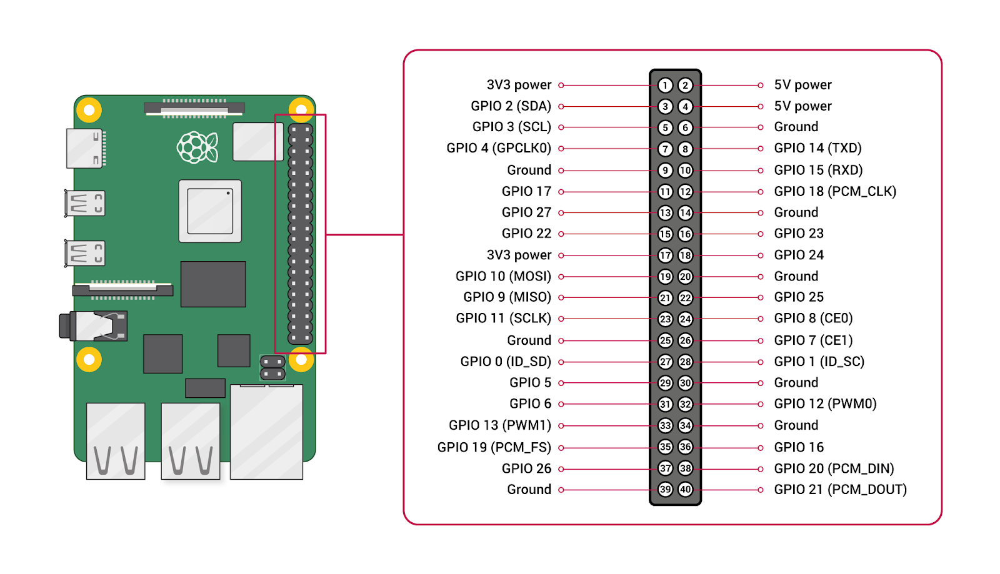

# Introducción a la Electrónica con Raspberry Pi

## ¿Qué es una Raspberry Pi?

La Raspberry Pi es un ordenador de placa única de bajo costo, del tamaño de una tarjeta de crédito que se conecta a un monitor o televisor y utiliza un teclado y un mouse estándar. Es una herramienta poderosa para el aprendizaje de la programación y la creación de proyectos de electrónica.

### Características Principales

- **Procesador**: ARM
- **Memoria RAM**: Varía según el modelo (512MB, 1GB, 2GB, 4GB, 8GB)
- **Sistema Operativo**: Generalmente Raspbian, basado en Debian
- **Puertos**: HDMI, USB, Ethernet, GPIO

## Sistema de Pines GPIO

GPIO (General Purpose Input/Output) son pines en la Raspberry Pi que permiten la interacción con otros dispositivos electrónicos. Puedes usar estos pines para leer entradas (como señales de sensores) o enviar salidas (como encender un LED).

### Configuración de los Pines GPIO

Los pines GPIO están numerados y cada uno tiene una función específica, aunque muchos pueden ser programados para realizar diversas tareas. Aquí está un esquema básico:

## ¿Qué es la electrónica?

La electrónica es una rama de la ciencia que estudia las aplicaciones que tratan con la
emisión, el flujo y el control de los electrones.

## Concepto de Circuito Cerrado

Un circuito cerrado es un camino completo que permite el flujo de electricidad desde una fuente de energía, a través de una carga (como un LED), y de vuelta a la fuente. En un circuito cerrado, todos los componentes están conectados y la electricidad puede fluir continuamente.

## Componentes Electrónicos

### Resistencia
Una resistencia es un componente electrónico pasivo que limita el flujo de corriente en un circuito. Se utiliza para proteger otros componentes, ajustar niveles de señal y dividir tensiones.

### LEDs (Diodos Emisores de Luz)
Un LED es un dispositivo semiconductor que emite luz cuando se le aplica una corriente eléctrica. Los LEDs son muy eficientes y se utilizan en una variedad de aplicaciones.

### Servomotores de 180 Grados
Un servomotor es un dispositivo que puede girar a posiciones específicas dentro de un rango de 180 grados. Son muy útiles para aplicaciones de robótica.

### Potenciómetros
Un potenciómetro es una resistencia variable que puedes ajustar para cambiar la cantidad de resistencia en un circuito. Se utiliza a menudo para controlar la intensidad de una señal.

Con estos conceptos y ejemplos, estás listo para comenzar a experimentar con tus componentes electrónicos utilizando la Raspberry Pi. ¡Diviértete creando tus propios proyectos!

